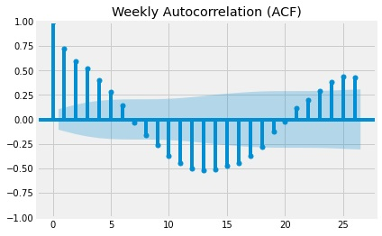

# Predicting Electrical Energy Consumption by Time Series Forecasting
## UC Riverside Capstone Project 
# Goals
- Utilize Seasonal Autoregressive Integrated Moving Average with eXogenous variables (SARIMAX) approach to forecast weekly and monthly energy consumption.  
- Create visualizations of the dataset to gibe insight to seasonal patterns of electrical consumption.
- Use autocorrelation functions (ACF) and partial correlation functions (PACF) followed by grid searching to find the best model.

# Overview
Utilizing hourly data of electrical loads from Duke Energy Ohio and Kentucky Corp. (DEO&K) and joining historical air temperature data from Cincinnati Northern Kentucky International Airport, future energy consumption can be modeled and predicted by time series forecasting. Time series forecasting is a data science technique that analyzes time series data using statistics and modeling to make predictions and inform strategic decisions (Lazzeri, 2021). This project will predict the amount of electricity DEO&K will use over the next year.   

# Area of Study
DEO&K covers the southwest tip of Ohio and a small area of northern Kentucky. Duke Energy is based in Charlotte, North Carolina which has subsidiaries in the studied area. As of 2022, DEO&K serves 880,000 residential, commercial, and industrial customers in a 3,000-square-mile service area, and natural gas service to 550,000 customers in a 2,650-square-mile service area. It is unknown the amount of energy storage DEO&K has, but collectively Duke Energy (which includes North Carolina, South Carolina, Florida, Indiana, Ohio, and Kentucky) owns 50,000 MW of energy capacity. The dataset was obtained on Kaggle, provided by PJM Interconnection LLC. 

# Model Predictions
The model forecasts 01-01-2017 to 08-03-2018 in both weekly and monthly datasets. Figure 8 shows the dataset (blue line) compared to the predicted values (red line) of the weekly and monthly datasets. The dashed line is 01-01-2017 where the dataset was split. 

Weekly Prediction:

Monthly Prediction:

 

## Results
Although visually the predictions of both models take the shape of the general dataset, statistical measures are high in both models. 

Weekly Model SARIMA(0,1,2)x(1,1,2,52):
|MSE|RMSE|MAE|MAPE|
|----|----|----|----|
|93920.15|306.46|254.14|7.6%|

Monthly Model SARIMA(0,1,2)x(1,1,2,12):
|MSE|RMSE|MAE|MAPE|
|----|----|----|----|
|35435.13|188.24|127.97|3.9%|

Weekly Lowest Mean Absolute Error (MAE)

|Date|MAE|
|----|----|
|2017-10-08|0.686|
|2017-10-15|11.9|
|2018-05-27|14.7|
|2018-07-15|22.3|
|2018-05-13|31.8|

Monthly Lowest Mean Absolute Error (MAE)

|Date|MAE|
|----|----|
|2017-03-31|2.07|
|2017-07-31|2.96|
|2018-06-30|8.00|
|2018-07-31|8.00|
|2017-12-31|11.8|
# SARIMA

Seasonal ARIMA (SARIMA) time series model is created by adding seasonal terms to the ARIMA model. SARIMA is written as 
ARIMA (p, d, q) x (P, D, Q) s 
where p is the order of nonseasonal autoregression, d is the number of regular differencing, q the order of nonseasonal MA, P the order of seasonal autoregression, D the number of seasonal differencing, Q is the order of seasonal MA, and s is the number of datapoints collected per season (Lazzeri, 2021).

The first part of the ARIMA model contains the order of the non-seasonal parameters while the orders of the seasonal parameters are contained in the second part. The ARIMA model is chosen by determining parameters p, d, and q (Astuti & Jamaludin, 2018). 

# Insights
Boxplots are used to visualize the general pattern of electricity consumption throughout the year. 

The average amount of electricy consumption is lower on the weekends (Saturday and Sunday) due to most buisnesses to be closed during these days.

There is a major peak in July (7) when the height of summer causes customers and businesses to cool their buildings. There is also a secondary peak in January (1) where winters are cold and in contrast to cooling, buildings are heated to maintain a comfortable temperature indoors. 

# Autocorrelation Function (ACF) and Partial Correlation Function (PACF)
The ACF and PACF are used to determine the appropriate AR(p) and MA(q) starting parameters, a grid search is then performed to find the best combination of patterns (Lazzeri, 2021). 

Weekly ACF exhibits tailing off indicating presence of autoregression (AR(p))

Weekly PACF has spikes at 1 and 2. AR(p) = (1,2)

Monthly ACF exhibits cyclic patterns at lags 1,3,5, and 9 which could mean quarterly effects. 

Monthly PACF has spikes at 1, 2, 3, and 5. AR(p) = (1,2). Because of limiting processing power AR(3,5) will not be studied.

## Grid Search
Grid Searching is an exhaustive search over a range of parameters. Doing this technique can test for all p, q, and d parameters ensures that we have the best model for prediction (Lazzeri, 2021).

Akaike’s Information Criterion (AIC) is used to determine SARIMA model parameters. The lowest AIC value will result in the best forecasting model (Stoica & Selén, 2004). 

Parameters p and q were given a range 0-3 (not inclusive) and d 0-2 (not inclusive). These ranges were set from the ACF and PACF from the previous section. 

### Weekly Akaike’s Information Criterion

|(p,d,q)  |(p,d,q,s)    |AIC       | 
|---------|-------------|----------|
|**(0, 1, 2)**|**(1, 1, 2, 52)**|**2595.04912**|
|(1, 1, 2)|(1, 1, 2, 52)|2595.38842|
|(1, 1, 2)|(0, 1, 2, 52)|2599.64050|
|(0, 1, 2)|(0, 1, 2, 52)|2600.19753|
|(0, 1, 2)|(2, 1, 2, 52)|2600.23637|

### Monthly Akaike’s Information Criterion

|(p,d,q)  |(p,d,q,s)    |AIC       | 
|---------|-------------|----------|
|**(0, 1, 2)**|**(1, 1, 2, 12)**|**540.742587**|
|(0, 1, 2)|(1, 1, 2, 12)|543.60816|
|(1, 1, 2)|(1, 1, 2, 12)|544.029311|
|(1, 1, 2)|(0, 1, 2, 12)|545.89382|
|(0, 1, 2)|(2, 1, 2, 12)|546.852477|
