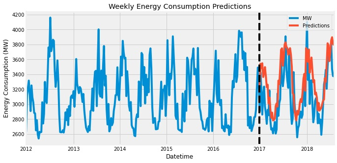

# Predicting Electrical Energy Consumption by Time Series Forecasting
## UC Riverside Capstone Project 
# Goals
- Utilize Seasonal Autoregressive Integrated Moving Average with eXogenous variables (SARIMAX) approach to forecast weekly and monthly energy consumption.  
- Create visualizations of the dataset to gibe insight to seasonal patterns of electrical consumption.
- Use autocorrelation functions (ACF) and partial correlation functions (PACF) followed by grid searching to find the best model.

# Overview
Utilizing hourly data of electrical loads from Duke Energy Ohio and Kentucky Corp. (DEO&K) and joining historical air temperature data from Cincinnati Northern Kentucky International Airport, future energy consumption can be modeled and predicted by time series forecasting. Time series forecasting is a data science technique that analyzes time series data using statistics and modeling to make predictions and inform strategic decisions (Lazzeri, 2021). This project will predict the amount of electricity DEO&K will use over the next year.   

# SARIMA

Seasonal ARIMA (SARIMA) time series model is created by adding seasonal terms to the ARIMA model. SARIMA is written as 
ARIMA (p, d, q) x (P, D, Q) s 
where p is the order of nonseasonal autoregression, d is the number of regular differencing, q the order of nonseasonal MA, P the order of seasonal autoregression, D the number of seasonal differencing, Q is the order of seasonal MA, and s is the number of datapoints collected per season (Lazzeri, 2021).

The first part of the ARIMA model contains the order of the non-seasonal parameters while the orders of the seasonal parameters are contained in the second part. The ARIMA model is chosen by determining parameters p, d, and q (Astuti & Jamaludin, 2018). 

# Insights
# Model Predictions
Weekly Prediction:

Monthly Prediction:

 

# Area of Study
 

# Data Structure

|                  x|                 y|  acq_date| frp| acq_time|County|
|-------------------|------------------|----------|----|---------|------|
|-123.79012382714633| 39.49769932079566|2014-04-16| 5.7|     2051| 06045|

## Spatial Analysis
Example output of spatial analysis:  
  
Credits: Vraj Patel
